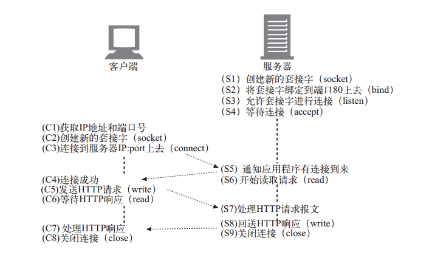

# 《HTTP权威指南》学习笔记


## URL

##### URI主要有两个子集： `URL` 和 `URN`

* URL通过资源位置来标识资源
* URN通过名字来识别资源

**PURL** 永久统一资源定位符，用URL来实现URN功能。


##### URL语法由 9 部分组成

``````
<scheme>://<user>:<password>@<host>:<port>/<path>;<params>?<query>#<frag>
``````

* `path` 分为多个路径段(path segment)，每个路径段都有自己的 `params` .
* `frag` 字段不会传送给服务器，由客户端内部使用。


## 报文

HTTP使用术语流入 `inbound` 和流出 `outbound` 来描述事务处理 `transaction` .

报文**发送者**总是位于**接收者**的上游(upstream)，所有报文都会向下游(downstream)流动。


#### 报文的语法

请求报文：

``````xml
<method> <request-URL> <version>
<headers>

<entity-body>
``````

响应报文:

``````xml
<version> <status> <reason-phrase>
<headers>

<entity-body>
``````

起始行和首部总是以 `CRLF` 结束。


#### 方法

常用HTTP方法： GET HEAD POST PUT TRACE OPTIONS DELETE.
由于HTTP设计得易于扩展，服务器还可以定义自己的`扩展方法`。

GET和HEAD被认为是 `安全方法` 。

###### GET

HTTP1.1 服务器必须实现此方法。用于请求服务器发送某个资源。

###### HEAD

HTTP1.1 服务器必须实现此方法。
与 `GET` 类似，但服务器在响应中只返回首部。开发者要确保其首部与GET返回的相同。

###### PUT

向服务器写入文档。

###### POST

向服务器输入数据。通常用来支持HTML表单。

###### TRACE

发起“环回”诊断，查看所有中间HTTP应用程序组成的链。主要用于诊断。

###### OPTIONS

请求Web服务器告知其支持的各种功能。

###### DELETE

删除请求URL所指定的资源。


###### 扩展方法

没有在HTTP1.1正式规范定义的方法。

最好按照惯例“对所发送的内容要求严一点，对所接收的内容宽松一点”来处理扩展方法。


#### 状态码

###### 分类：

| 整个范围    | 已定义范围   | 分类         |
| ----------- |:------------:| ------------:|
| 100 ~ 199   | 100 ~ 101    | 信息提示     |
| 200 ~ 299   | 200 ~ 206    | 成功         |
| 300 ~ 399   | 300 ~ 305    | 重定向       |
| 400 ~ 499   | 400 ~ 415    | 客户端错误   |
| 500 ~ 599   | 500 ~ 505    | 服务器错误   |

**100 Continue**：是一种优化，客户端在避免向服务器发送大实体时使用。
通常与 `Expect` 请求头配合使用，客户端在发送实体前等待100响应。

**204 No Content**: 响应报文包含若干首部和一个状态行，无实体的主体部分。
主要用于浏览器不转为新文档的情况下，对其进行更新。


> 302、303、307的区别

> `302` 在HTTP1.0时使用：客户端发出POST请求后收到服务器的302状态码，那么不能自动的向新的URI发送重复请求，
> 必须跟用户确认是否该重发(POST方法非幂等)。但是多数浏览器会获取到HTTP响应报文首部的Location字段信息，
> 并发起一个GET请求。

> `303` 在HTTP1.1中使用：大多数支持HTTP1.1的浏览器会将 302 当作 303 处理，其意义与 302 完全相同。

> `307` 在HTTP1.1中使用：用来代替 302 , 不会把POST转为GET.

> 也就是说， 302 由HTTP1.0细化为HTTP1.1中的 303 和 307.

**410 Gone**：与404类似，只是服务器曾拥有过此资源。


#### 首部

分类：

* 通用首部：可以出现在请求、响应报文中
* 请求首部
* 响应首部
* 实体首部
* 扩展首部


## 连接管理

#### Web浏览器通过TCP连接与Web服务器进行交互

一次请求过程：

1. 浏览器解析出主机名
2. 浏览器查询出主机名的IP地址
3. 浏览器获得端口号
4. 浏览器发起连接
5. 浏览器向服务器发起HTTP GET报文
6. 浏览器从服务器读取HTTP报文
7. 浏览器关闭连接

TCP数据是通过IP数据报的小数据块来发送的。

网络接口 -- IP -- TCP -- (TLS or SSL) -- HTTP

TCP通过 `端口号` 来保持连接的正确运行。

TCP连接通过4个值来唯一识别：

``````
源IP地址、 源端口号、 目的IP地址、 目的端口号
``````

TCP Socket通信：




#### TCP 性能

HTTP事务时延主要原因：

1) 根据URI确定Web服务器IP和端口，DNS解析可能需要数10秒。(DNS缓存)

2) TCP连接建立时延通常有一两秒钟，HTTP事务多时会叠加

3) 网络传输报文及Web服务器从TCP连接中读取、处理报文都需要时间

4) Web服务器HTTP响应需要时间


#### HTTP 连接

提高HTTP连接性能的四类技术：

##### 一、并行连接

**1.并行连接可能会提高页面的加载速度。**

通过并行连接克服单条连接的空载时间和带宽限制。时延可以重叠，装载可并行。

**2.并行连接不一定更快**

带宽较小时，并行加载的多个对象会竞争有限的带宽，每个对象都会以较慢的速度加载；
打开大量连接会消耗内存资源，引发自身性能问题。

**3.并行连接可能让人感觉更快**

用户看到加载过程，整个页面多个对象同时加载。

##### 二、持久连接

> `站点本地性(site locality)` 初始化了对某服务器HTTP请求的应用程序，
很可能会在不久的将来对那台服务器发起更多的请求。

> `持久连接` 在事务处理结束之后仍然保持在打开状态的TCP连接。
它会在不同事务之间保持打开状态，由客户端或服务器主动关闭。

持久连接可以避开缓慢的连接建立阶段和TPC慢启动过程。

持久连接可能会累积大量空闲连接。可以与并行连接配合使用。

**Keep-Alive**

HTTP1.0的扩展，已不再使用，HTTP1.1规范中没有相关说明。但实际应用中仍广泛使用。

客户端请求头中包含 `Connection: Keep-Alive` 将连接保持打开状态，服务端响应同样的首部。
否则认为服务器不支持keep-alive, 客户端在发回响应报文后关闭连接。

Keep-Alive选项：

* `timeout` 估计了服务器希望保证连接的时间(并非承诺值)。
* `max` 估计了服务器还希望为多少个事务保持此连接(并非承诺值)。
* `name[=value]` 任意未经处理的属性，主要用于诊断和调试。

限制和规则：

* HTTP1.0中不是默认的，客户端必须显示发送相应首部。
* 响应报文中没有相应首部，代表服务器关闭连接。
* 持久连接实体的主体部分必须有正确的 `Content-Length`，有 `多部件媒体类型`，
或者用 `分块传输编码` 的方式进行编码。
* 代理或网关必须执行 Connection 首部的规则：将报文转发或高速缓存前，删除
Connection 首部中命名的所有首部字段以及 Connection 首部自身。
* 应忽略所有来自HTTP1.0的 Connect 首部


**哑代理**

> `blind relay` 盲中继：代理将字节从一个连接转发到另一个连接，不对Connection首部特殊处理。

代理和逐跳首部：Connection、Proxy-Authenticate、Proxy-Connenction、Transfer-Encoding、Upgrade


##### 三、管道化连接

在持久连接的基础上可选的使用 `请求管道`。在响应到达之前，将多条请求放入队列，降低网络环回时间。

服务器可以在任意时刻关闭一条TCP连接。

代理应该原封不动的转发包含错误Content-Length的请求，而不要试图纠正。

`幂等` 一个事务不管执行一次或是多次，结果都是相同的。GET、HEAD、PUT、DELETE、TRACE和OPTIONS都是幂等的。
客户端不应该以管道化方式传送非幂等操作，如POST。


##### 四、复用的连接

交替传送请求和响应报文(试验阶段)。


##### 关闭连接

TCP连接是双向的，每一端都有一个输入队列和一个输出队列。

套接字 `close()` 会将TCP输入和输出信道都关闭，称为 `完全关闭` 。
套接字 `shutdown()` 可以单独关闭输入或输出信道，称为 `半关闭` 。

关闭输出信道总是安全的。关闭输入信道比较危险，除非知道另一端不再发送其它数据。

将数据传送到已关闭的连接时会产生 `连接被对端重置` 错误。

无法确保对等实体会实现半关闭，或对其进行检查。因此想要正常关闭连接，应用程序应该先半关闭其输出信道，
然后周期性地检查其输入信道的状态。如果在一定的时间区间内对端没有关闭输入信道，应该程序可强行关闭连接。


## Web服务器

### 一、接受客户端连接

1. 处理新连接
2. 客户端主机名识别
3. 通过ident确定客户端用户

ident协议可以在组织内部使用，但不能在公共因特网上很好的工作。

### 二、接收请求报文

Web服务器输入输出结构：

* 单线程Web服务器
* 多进程及多线程Web服务器
* 复用IO的服务器
* 复用的多线程Web服务器

### 三、处理请求

### 四、对资源的映射及访问

Web服务器是资源服务器。

### 五、构建响应

响应报文通常包含 Content-Type、Content-Length和主体

MIME类型、魔法分类、显式分类、类型协商

### 六、发送响应

### 七、记录日志


##  代理


#### 代理是Web的中间实体

* `公共代理` 众多客户端共享的代理。(如，高速缓存代理服务器)
* `私有代理` 某个客户端专用或很多客户端共享。


* `代理` 连接的是两个或多个使用相同协议的应用程序。
* `网关` 连接的是两个或多个使用不同协议的端点。
* 实际上两者区别很模糊，很多代理服务器也实现网关的功能来支持SSL、FTP等。


**代理示例**

* 儿童过滤器(过滤黑名单)
* 文档访问控制(权限控制)
* 安全防火墙
* Web缓存
* 反向代理
* 内容路由器
* 转码器(图片压缩等)
* 匿名者

**常用部署方式**

* 出口代理：固定在本地网络的出口点
* 访问(入口)代理：ISP访问点上，处理客户聚合请求
* 反向代理：部署在网络边缘，Web服务器之前
* 网络交换代理：网络之间对等交换点上，通过缓存缓解拥塞

**代理层次结构**

`proxy hierarchy` 代理级联方式。
下一个入口(inbound)代理(靠近服务器)被称为`父代理`,
下一个出口(outbound)代理(靠近客户端)被称为`子代理`,

代理层次结构可以是动态的，随请求而变。

动态选择父代理示例：

* 负载均衡
* 地理位置附近的路由
* 协议/类型路由
* 基于订购的路由


**Web请求导向代理的方法**

* 修改客户端
* 修改网络( `拦截代理` )
* 修改DNS的命名空间
* 修改Web服务器(305重定向等)

**Via首部**

Via列出了报文经过的中间节点，报文每经过一个节点都必须将该节点添加到Via列表的尾部。

代理也可以通过Via首部来检测路由循环。

`waypoint` 路标：Via首部中表示一个独立的代理服务器或网关，由逗号分隔。

每个Via路标最多包含四个组件：

1. 可选的协议名(默认HTTP)
2. 必选的协议版本
3. 必选的节点名：主机+端口(如果无端口，使用协议默认端口)
4. 可选的描述性注释

请求和响应报文中都有Via首部，且通常相反。

`Server` 首部用来描述原始服务器使用的软件，代理一定不能修改 Server 首部。

Via的隐私和安全问题：可能暴露防火墙后的主机名、端口和网络结构。
可以通过隐藏主机名或压缩合并多个路标解决。

TRACE方法可以用来追踪调试代理流，但它还没有得到广泛实现。
`Max-Forwards` 可以用来限制最大的代理跳数。

**代理认证**

> HTTP/1.0 407 Proxy Authorization Required

> Proxy-Authenticate: Basic realm="Secure Stuff"

1. 代理服务器对受限请求返回407及Proxy-Authenticate响应报文；
2. 客户端从本地数据库或提示用户搜集所需要的证书；
3. 客户端重发请求，在Proxy-Authorization首部提供所要求的证书；
4. 证书有效则代理将原始请求沿传输链路向下传送，否则返回另一条407应答；

链路中有多个需要认证的代理时，不能很好的工作。HTTP升级目前没有广泛实现。

**代理的互操作性**

使用OPTIONS方法判定服务器支持的方法。

HTTP1.1中使用 `Allow` 首部响应服务器所支持的方法。例如：

``````
Allow: GET, HEAD, PUT
``````


## 缓存

