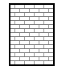
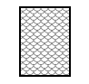
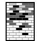

# An Introduction to Disk Partitions 硬盘分区介绍

*ps: 来自 Fedora 官方文档 `Installation Guide` 附录Ｂ*

**个人翻译供学习用，版权归Fedora所有。因中国大陆的网络问题，暂无法提交到 `Fedora  Documentation` 项目。 -- ssbunny**

> This appendix is not necessarily applicable to architectures other than AMD64 and Intel 64. However, the general concepts mentioned here may apply.

> 该附录不仅适用于 AMD64 或 Intel64 系统。这里提到的一般性概念通常可以通用。

This section discusses basic disk concepts,
disk repartitioning　strategies,
the partition naming scheme　used　by Linux systems, and related topics.

该部分讨论了磁盘的基本概念、磁盘重分区策略、Linux系统分区命名方案及相关主题。

If you are comfortable with disk partitions,
you can skip ahead to　Section 2,　“Strategies for　Disk　Repartitioning” for more information on the process of freeing up disk space to prepare for a Fedora　installation.

如果你对磁盘分区感兴趣，可以直接跳至第2小节《磁盘重新分区策略》，
以便了解更多关于Fedora安装时释放磁盘空间的过程。

## 1.Hard Disk Basic Concepts 硬盘的基本概念

Hard disks perform a very simple function - they store data and reliably retrieve it on command.

硬盘的功能非常简单——它们被用来存储数据并可以通过命令可靠地检索到这些数据。

When discussing issues such as disk partitioning, 
it is important to have a understanding of the　underlying hardware;
however, since the　theory is very complicated and expansive,
only the basic　concepts will be explained here.
This appendix uses a set of simplified diagrams of a disk drive to help explain what is the process and theory behind partitions.

当讨论磁盘分区时，对其底层硬件有个基本理解是非常重要的。然而由于这部分理论十分复杂且宽泛，在此只会解释一些基础概念。该附录通过一组简易的磁盘驱动器图表解释了分区背后的过程和理论。

Figure 1, “An Unused Disk Drive”, shows a brand-new, unused disk drive.

图1　"未使用的磁盘驱动器"展示了一个全新的、未使用的磁盘驱动器。

Figure 1　An Unused Disk Drive

图1 未使用的磁盘驱动器

### 1.1. File Systems　文件系统

To store data on a disk drive,　it is necessary to format the disk drive　first. Formatting (usually known　as "making a file system") writes information to the drive, creating order out of the empty space in an　unformatted drive.

若想在磁盘驱动器上存储数据，必需先进行格式化。格式化(通过被当作"制作文件系统")会往驱动器上写入一些规则信息，这些规则信息创建在未格式化的空闲驱动器上。

Figure 2. Disk Drive with a File System

图2 带有文件系统的磁盘驱动器

As Figure 2, “Disk Drive with a File System”, implies, the order imposed by a file system involves some trade-offs:

图2 "带有文件系统的磁盘驱动器", 显示了文件系统规则包含的权衡：

* A small percentage of the driver's available space is used to store file system-related data and can be considered as overhead.
* 磁盘驱动器的可用空间中，有一小部分被用来存放系统相关的数据文件。
* A file system splits the remaining space into small, consistently-sized segments. For Linux, these segments are known as blocks.	
* 文件系统会将剩余空间切分成大小一致的小片段。在Linux中，这些片段被称为 `块` 。

Note that there is no single, universal file system. As Figure 3, “Disk Drive with a Different File System”, shows, a disk drive may have one of many different file systems written on it. Different
file systems tend to be incompatible; that is, an operating system that supports one file system (or a handful of related file system types) may not support another. However, Fedora supports a wide
variety of file systems (including many commonly used by other operating systems such as Microsoft Windows), making data interchange between different file systems easy.

要知道，并没有单一通用的文件系统。像图3 “装有不同文件系统的磁盘驱动器”中展示的那样，一个磁盘驱动器中可以写入多个不同的文件系统。不同的文件系统往往是不相兼容的；换句话说，支持一种文件系统(或少量相关文件系统类型)的操作系统通常不支持另一种文件系统。然而，Fedora支持多种类型的文件系统(包括许多在其它操作系统,如微软Windows下使用的),使得不同文件系统间的数据交换十分容易。

Figure 3. Disk Drive with a Different File System

图3 装有不同文件系统的磁盘驱动器

Writing a file system to disk is only the first step. The goal of this process is to actually store and retrieve data. The figure below shows a drive disk after some data have been written to it:

将文件系统写入磁盘仅仅是第一步。这一过程的目的是实际存储及数据检索。下图展示了已经写入数据的磁盘驱动器：

Figure 4. Disk Drive with Data Written to It

图4 写入数据的磁盘驱动器

As Figure 4, “Disk Drive with Data Written to It”, shows, some of the previously-empty blocks are now holding data. However, by just looking at this picture, we cannot determine exactly how many files
reside on this drive. There may only be one file or many, as all files use at least one block and some files use multiple blocks. Another important point to note is that the used blocks do not have to form a contiguous region; used and unused blocks may be interspersed. This is known as fragmentation.Fragmentation can play a part when attempting to resize an existing partition.

在图4中，先前的一些空块被放入了数据，但是仅通过看图，我们并不能判断出到底有多少文件位于此驱动器上，也许是一个文件，也可能是很多文件，因为任何文件至少会占用一个块当然也可能更多的块。另一个值得注意的要点是，已使用的块并不必是连续的区域，使用的、未使用的块可以穿插出现，这被称为 `碎片` 。碎片在调整现有分区时会产生影响。

As with most computer-related technologies, disk drives changed over time after their introduction. In particular, they got bigger. Not larger in physical size, but bigger in their capacity to store information. And, this additional capacity drove a fundamental change in the way disk drives were used.

和大多数计算机相关技术一样，磁盘驱动器技术自诞生之日起曾发生多次变化。特别是，它们变得越来越大。并不是说它们的实际尺寸在变大，而是存储信息的容量变的越来越大。同时，多出来的容量也给磁盘驱动器的使用方式带来了根本性的变革。

### 1.2. Partitions: Turning One Drive Into Many 分区：将一个驱动器划分为多个

Disk drives can be divided into partitions. Each partition can be accessed as if it was a separate disk. This is done through the addition of a partition table.

磁盘驱动器可以划分成多个 `分区` ，每个分区均可以被当作独立的磁盘访问。分区操作通过磁盘分区表完成。

There are several reasons for allocating disk space into separate disk partitions, for example:

有很多将磁盘空间分成独立的磁盘分区的原因，例如：

* Logical separation of the operating system data from the user data
* 实现操作系统数据和用户数据的逻辑分离
* Ability to use different file systems
* 提供使用不同文件系统的能力
* Ability to run multiple operating systems on one machine
* 提供在一台机器上运行多个操作系统的能力

There are currently two partitioning layout standards for physical hard disks: Master Boot Record (MBR) and GUID Partition Table (GPT). MBR is an older method of disk partitioning used with BIOS-based computers. GPT is a newer partitioning layout that is a part of the Unified Extensible Firmware Interface (UEFI). This section and Section B.1.3, “Partitions Within Partitions - An Overview of Extended Partitions” mainly describe the Master Boot Record (MBR) disk partitioning scheme. For information about the GUID Partition Table (GPT) partitioning layout, see Section B.1.4, “GUID Partition Table (GPT)”.

目前有两种硬盘分区配置标准：主引导记录(Master Boot Record, MBR)和 GUID 分区表(GUID Partition Table, GPT). MBR是基于BIOS的电脑的一种老的分区方法，而GPT是一种新的分区方法，它是统一可扩展固件接口(UEFI)的一部分。该小节以及1.3小节主要描述 MBR 分区模式。关于 GPT 分区，参见第1.4小节。

> While the diagrams in this chapter show the partition table as being
> separate from the actual disk drive, this is not entirely accurate.
> In reality, the partition table is stored at the very start of the disk,
> before any file system or user data. But for clarity,
> they are separate in our diagrams.

> 由于本章中的图表展示的分区表和实际的磁盘驱动器是分离的，因此并不完全准确。事实上，
> 分区表存储在磁盘的始端，位于任何文件系统或用户数据之前，但为了清晰起见，
> 在我们的图表中将其分离出来。

Figure 5. Disk Drive with Partition Table

图5 带有分区表的磁盘驱动器

As Figure 5, “Disk Drive with Partition Table” shows, the partition table is divided into four sections or four primary partitions. A primary partition is a partition on a hard drive that can contain only one logical drive (or section). Each section can hold the information necessary to define a single partition, meaning that the partition table can define no more than four partitions.

图5 展示出分区表分成四部分或者说四个主分区。主分区是这样一种硬盘分区，它只能包含一个逻辑驱动器(或一部分)，每部分持有其所需信息以定义独立的分区，这意味着分区表最多可定义四个分区。

Each partition table entry contains several important characteristics of the partition:

• The points on the disk where the partition starts and ends
• Whether the partition is "active"
• The partition's type

