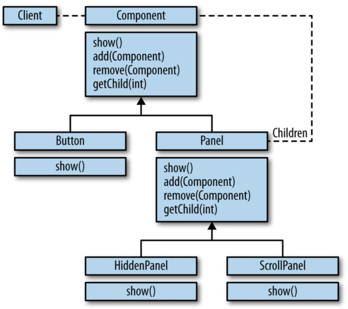
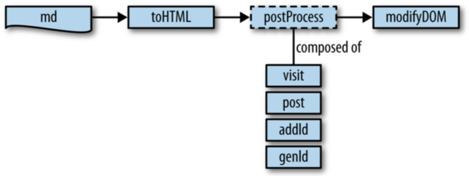
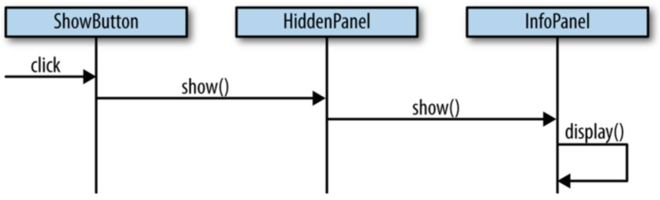
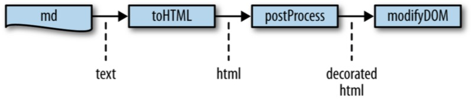
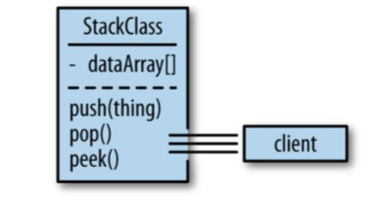
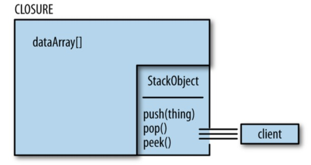

# Functional JavaScript

Learn Underscore.js

## 1.函数式编程

### 1.1.JavaScript

**灵活性**

1) 函数可以返回另一个函数:

```js
function splat(fun) {
    return function(array) {
        return fun.apply(null, array);
    };
}
var addArrayElements = splat(function(x, y) { return x + y });
addArrayElements([1, 2]); //=> 3
```

2) 函数可以在任意时刻调用，并传入任意数量、任意类型的参数:

```js
function unsplat(fun) {
    return function() {
        return fun.call(null, _.toArray(arguments));
    };
}
var joinElements = unsplat(function(array) { return array.join(' ') });
joinElements(1, 2); //=> "1 2"
joinElements('-', '$', '/', '!', ':'); //=> "- $ / ! :"
```

**局限性**

* 语法怪异
* 功能特性不稳定
* 大量类库竞争

### 1.2.函数式编程

**概念**

> **Functional programming** is the use of functions that transform values into units of abstraction, subsequently used to build software systems.

#### 1.2.1.本质

本质：将大程序拆分成小的。

1) **面向对象**以“对象”(名词)为分组依据，大对象通过小对象组合而来：



**函数式**以“函数”(动词)为分组依据，大函数通过小函数组合而来：



2) **面向对象**通过方法调用进行对象间的交互：



**函数式**通过数据传递进行函数间的交互：



#### 1.2.2.函数作为抽象单元

UNIX 社区名言：

> Make it run, make it right, make it fast.

使用函数式编程，可以实现：

> Make it run, then make it right, then make it fast.

以函数为抽象单元，拆分大函数。

#### 1.2.3.封装

传统**OOP**中，封装通过打包、隐藏数据并提供操作数据的行为方法实现。



JavaScript的对象系统不能隐藏数据，需通过**闭包**实现：



闭包也是一种函数。

#### 1.2.4.函数作为行为单元

例如，常规数组索引：

```js
var letters = ['a', 'b', 'c'];
letters[1];
//=> 'b'
```

可以抽象为 `nth` 函数，并做合法性验证：

```js
function nth(a, index) {
    if (!_.isNumber(index)) fail("Expected a number as the index");
    if (!isIndexed(a)) fail("Not supported on non-indexed type");
    if ((index < 0) || (index > a.length - 1))
        fail("Index value is out of bounds");
    return a[index];
}
```

使用时：

```js
nth("abc", 0); //=> "a"
nth({}, 2);
// Error: Not supported on non-indexed type
```

进而抽象出 `second` 函数：

```js
function second(a) {
    return nth(a, 1);
}

second(['a','b']); //=> "b"
second("fogus"); //=> "o"
```

#### 1.2.5.数据抽象

JavaScript的对象**原型**模型是一种函数式数据模型。
比基于类的对象系统更便于使用数据。


