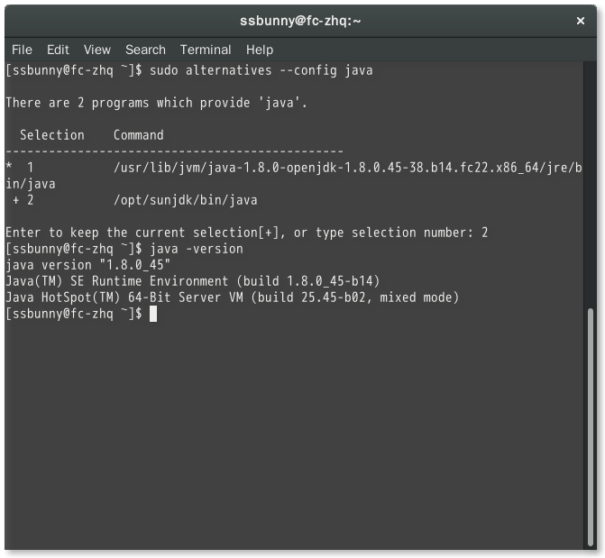

## 遇到的各种问题汇总

### 1. OpenJDK 和 SunJDK 共存问题

(Tue 2 Jun, 2015)

以前为了使用不同的jdk，通常通过配置 `.bash_profile` 将 `$PATH` 里需要用的 jdk
路径放到前面。其实可以通过 **alternatives** 命令配置不同的java命令。
它是一个典型的策略模式的实现。

安装新的策略：

````````sh
alternatives --install /usr/bin/java java /opt/sunjdk/bin/java 3
````````

选择策略：

````````sh
alternatives --config java
````````


通过 `alternatives` 命令，不仅可以管理不同类型的 java 命令，也可以管理其不同版本。
